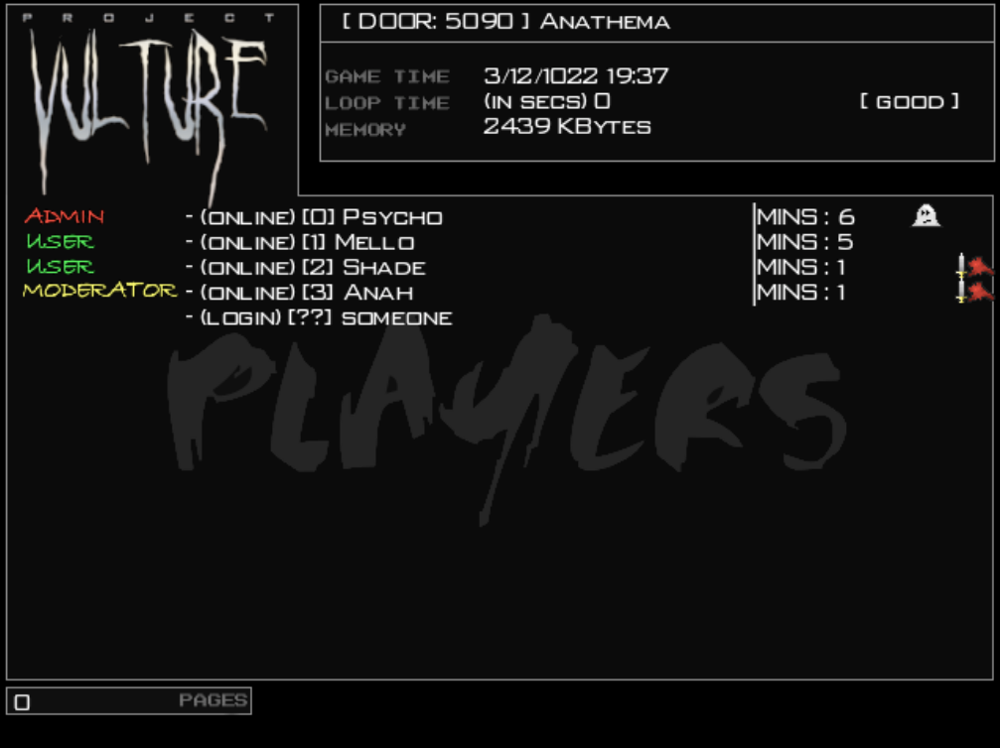
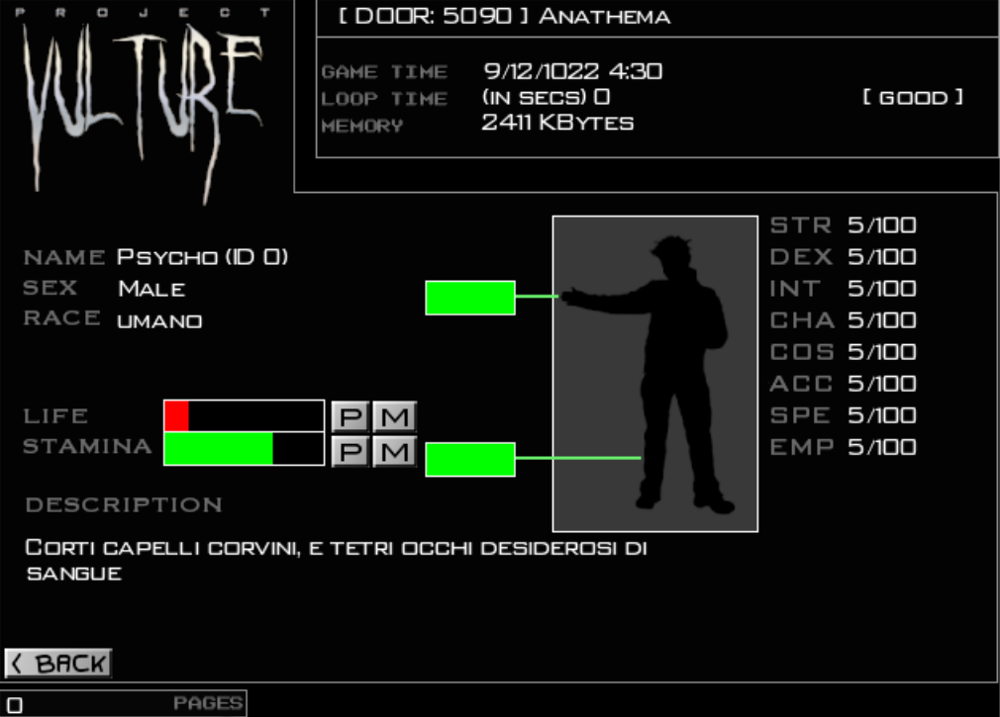

# Project Vulture
Project Vulture is an italian 2007 game for multi-player adventures developed and distributed by Psycho Games&copy; Studios.

The idea of Project Vulture is to create an easy-to-understand environment for GDR campaigns and adventures, playable remotely with a simple (and pre-installed everywhere) Telnet client.

## Languages
Unfortunately the italian language has been hardcoded into the game, thus no other languages are available. I am very sorry but I was young and naive.

## Dependencies
- libsdl2-dev

## Server interface
The interface is really clean and easy to understand. It allows "The Master" (aka "The Designer" that is the person that creates the adventure and handles every event or NPC in the game) to control immediately the status of the connected players.

This picture represents Project Vulture's control panel. From this interface you can easily read the port used by the service (**5090**) and the title of the running adventure (**Anathema**) on top. The following three rows are:
* **Game Time** Date and time into the adventure;
* **Loop Time** Number of seconds required for a single loop in the game (when this value increases, the delay of each client increases);
* **Memory** Memory taken by the adventure;

After these information, you'll find a list of connected players in the following format:

**Rank** - (**status**) [**ID**] **nickname** | MINS: (**connected minutes**) [**hide**] [**fighting**]

In this scenario is easy to see that the administrator Psycho is hidden (often The Master follows the players hidden in order to generate events) while the player Shade and the Moderator Anah are fighting. Moderators are very useful as helper for The Master: they impersonate other characters or monsters in order to control them and give them a kind of high-level intelligence.
By clicking on a players in the list, it is possible to open a dedicated interface to control details of each character like life level, stamina level, description and characteristics.

From this interface you can even increase and decrease the life and stamina values in real life by using "P" and "M" buttons.

## Connect to the game
To connect to the game once the server is up and kicking, knowing the port used by the adventure, is enough to launch telnet with the following parameters:
$ telnet <IP> <port>
At that point you have to insert username and password defined for your character (for the test adventure is 'username' and 'password').

## Adventures
PVAS (Project Vulture's Adventure Scripts) are folders organized in a very easy-to-understand way with different configuration files written in a HTML-like syntax to identify the game information, maps, items and players of the adventure. The adventure folder (labeled **adventure**) has to be stored into the same folder of the project_vulture.bin executable. Inside the sub-folders *objects* and *mobs* you will find a list of templates for items and NPC that you, as The Master, can use and generate in your adventure to populate the different areas.

An example world has been created and attached to the game (in the folder adventure). You can log in with the following account:
* username *username*
* password *password*.

An amazing editor for PVAS, developed by Luca Caprini in 2008 (https://github.com/lcaprini) is available in the folder *editor*

## Details
More information about the game are collected in the original document released with the game in 2007. Download [here](./doc/manual.pdf) the Game Manual.
